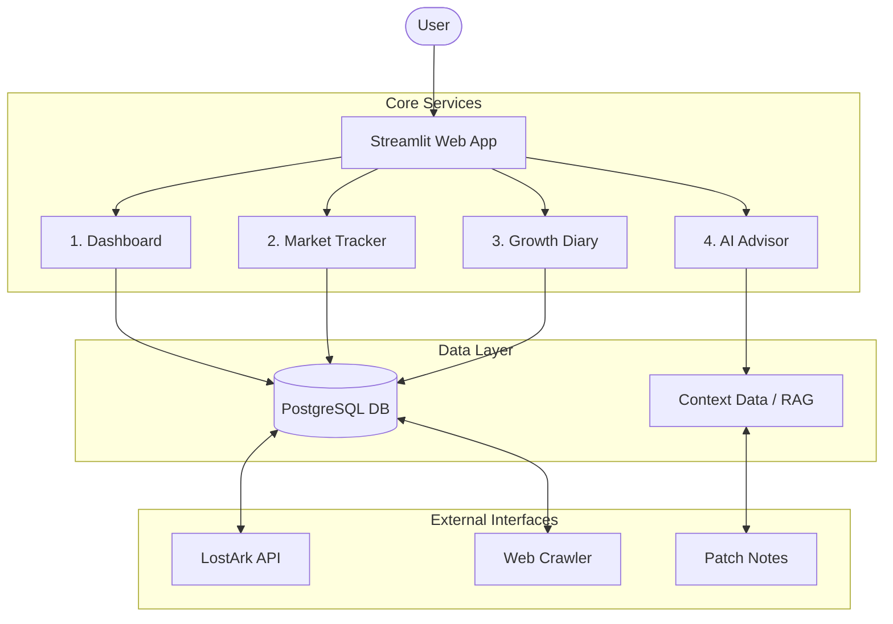

## 1. 서비스 구조도 (Service Overview)
LOA AGENT v2는 크게 4가지 핵심 모듈로 구성됩니다.

**2. 데이터베이스 설계 (Database Strategy)**
* **PostgreSQL 채택 이유:**
  * 로스트아크의 방대한 아이템 및 시세 데이터(Time-series Data)를 안정적으로 처리하기 위함.
  * JSON 타입 지원을 통해 유동적인 게임 데이터 스키마에 대응.
  * 추후 AWS RDS(PostgreSQL)로의 마이그레이션을 고려한 표준 호환성 확보.

**3. 모듈별 상세 명세 (Module Details)**
**1) Dashboard (Control Tower)**
* **역할:** 사용자의 일일/주간 루틴(숙제) 관리 및 재화 흐름 파악.
* **주요 기능:**
  * 원정대 캐릭터별 숙제 체크리스트 (Check-box Interaction)
  * 주간 예상 골드 수익 vs 실제 수익 계산 (ROI)
  * [v2 개선] DB 연동을 통한 실시간 상태 저장 및 불러오기

**2) Market Tracker (Economy)**
* **역할**: 변동성이 큰 로스트아크 경제 시스템 분석.
* **주요 기능**:
  * 주요 재련 재료 및 각인서 시세 크롤링/API 수집
  * "지금 사야 할까?" 판단을 돕는 시세 추이 그래프 제공

**3) Growth Diary (History)**
* **역할**: 사용자의 성장을 시각화하고 기록.
* **주요 기능:**
  * 날짜별 아이템 레벨 및 전투력 스냅샷 저장
  * 사용자 커스텀 메모(일기)와 성장 지표를 타임라인 형태로 제공

**4) AI Commander (Consultant)**
* **역할**: 데이터 기반의 의사결정 지원 (Decision Making Support).
* **작동 원리:**
  * Input: 내 캐릭터 스펙 + 최신 패치 노트 + 디렉터 발언 + 현재 시세
  * Process: LLM에게 위 정보를 맥락(Context)으로 주입 (RAG 기법 활용 예정)
  * Output: "현재 1640레벨에서 1680을 가는 것이 골드 효율상 이득인가?" 등의 질문에 대한 분석적 답변